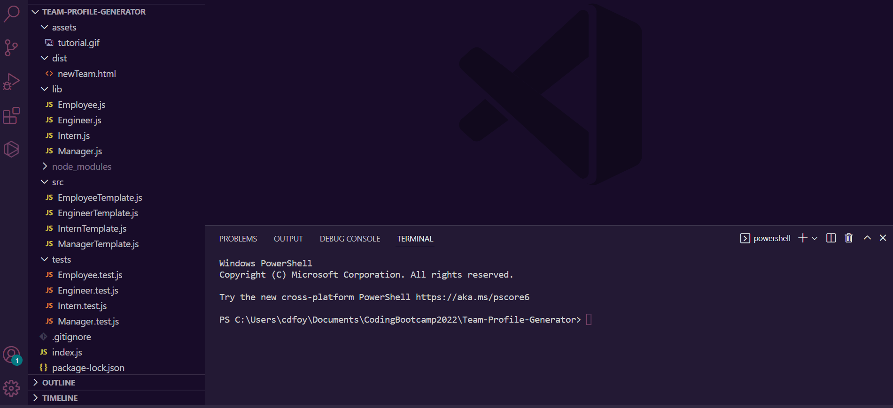

# Team-Profile-Generator

  

  ## Description

  A command line application to create a new employee directory. The user will be asked to answer prompt questions pertaining to the team manager, engineer, or intern information. The user can add as many engineers or interns as they would like, and when they are finished a new HTML file is generated, displaying their new team page.
  
  ## Table of Contents
  
  - [Installation](#installation)
  - [Usage](#usage)
  - [Contributing](#contributing)
  - [Tests](#tests)
  - [Questions](#questions)
  
  ## Installation
  
  - You will need to have node.js installed before running this application.
  - Clone this repository
  - The Inquirer package is used to generate the new HTML file from a user's input
  - Make sure you are in the directory of the cloned repository
  - Enter "npm install inquirer" in the terminal to install inquirer
  - Enter "node index.js" in your terminal
  - Follow the prompts to generate your new HTML file
  
  
  ## Usage
  
  [Link to the Team-Profile-Generator repository](https://github.com/cdfoye/Team-Profile-Generator)

  The following gif walkthroughs how to use this application:

  
  
  ## Contributing

  If you would like to contribute please reach out to me on Github or send me an email.
  
  ## Tests

  - Jest is used to run the Employee, Manager, Engineer, and Intern tests
  - After following the instructions from the [Installation](#installation) section:
  - Enter "npm install --save-dev jest" in the terminal to install Jest
  - Enter "npm run test" in the terminal to run the tests
  

  ## Questions

  If you have any questions please visit my Github profile: [cdfoye](https://github.com/cdfoye)

  For additional questions you can email me at cdfoye@gmail.com

